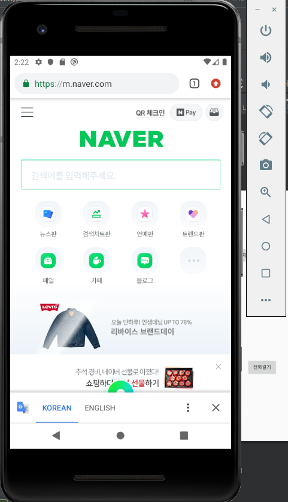
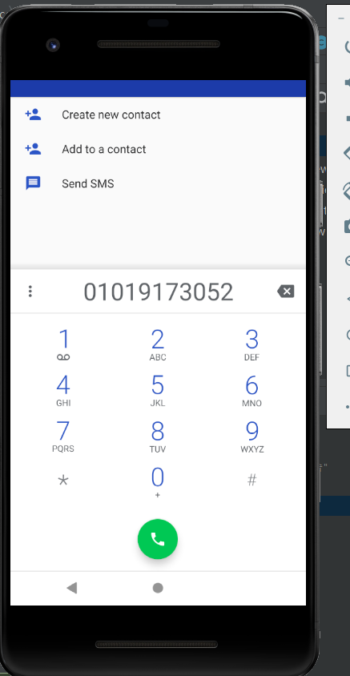
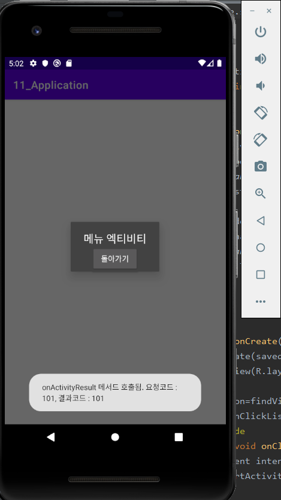

# 19173052 이진주
  [lee-jinjoo](https://github.com/lee-jinjoo)
## 2주차 과제
</img>

## 3주차 과제
</img>
</img>

## 4주차 과제
   -아이디어명-지하철 알람
   
         지하철에서 잠시 잠들었을때 출발지와 목적지를 설정해두면 목적지 ~분전에 이어폰을 통해 알람이 울려 
         역을 지나치지 않게 해주는 앱/ 편하게 지하철의 경로와 시간을 확인할 수 있도록해주는 앱,
         일상생활에서의 알람 기능도 있으면 좋을 것 같음
         
## 7주차 과제
</img>
</img>

## 9주차 과제
</img>
</img>
</img>
</img>

## 10주차 과제
</img>

## 11주차 과제
</img>
